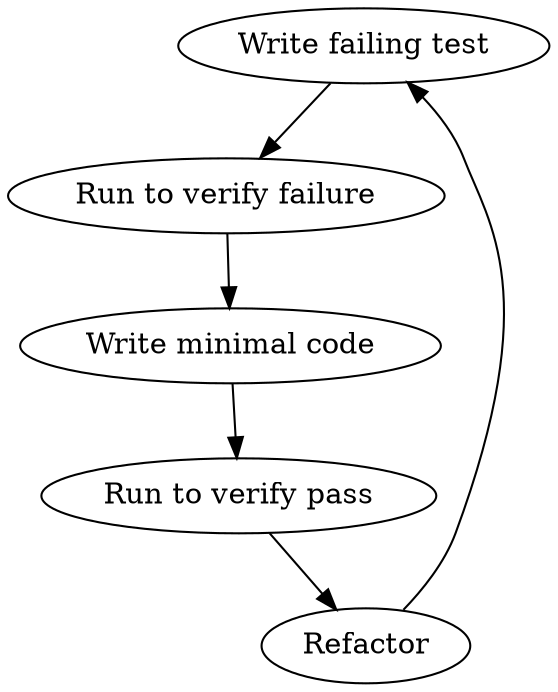

---
paths:
  - "**/*.test.{ts,js,py,java,go}"
  - "**/*.spec.{ts,js,py,java,go}"
  - "**/*.integration.test.{ts,js,py,java,go}"
  - "**/*.e2e.test.{ts,js,py,java,go}"
  - "**/test/**/*.{ts,js,py,java,go}"
  - "**/tests/**/*.{ts,js,py,java,go}"
  - "**/__tests__/**/*.{ts,js,py,java,go}"
---

# Testing Rules

Based on The Art of Software Testing, Refactoring, Clean Code

---

## 1. Testing Philosophy

### Core Principles

| Principle | Description |
|-----------|-------------|
| Self-Testing Code | Tests catch own errors |
| Every module has tests | Tests drive quality |
| Run tests frequently | Every few minutes |
| Tests are documentation | Tests describe intended behavior |

### TDD Cycle



| Phase | Action | Goal |
|-------|--------|------|
| Red | Write failing test first | Tests define behavior |
| Green | Write code to pass test | Minimal implementation |
| Refactor | Make code clean | Maintain quality |

```typescript
// Red: Failing test
describe('Calculator', () => {
  it('should throw error when dividing by zero', () => {
    const calc = new Calculator();
    expect(() => calc.divide(1, 0)).toThrow('Division by zero');
  });
});

// Green: Implementation
class Calculator {
  divide(a: number, b: number): number {
    if (b === 0) {
      throw new Error('Division by zero');
    }
    return a / b;
  }
}
```

### BDD Pattern

| Pattern | Description | Example |
|---------|-------------|---------|
| Given | Context/initial state | Given a logged-in user |
| When | Action/event | When placing an order |
| Then | Expected outcome | Then order is confirmed |

---

## 2. Test Types

### Testing Pyramid

```
           /\
          /  \    E2E Tests (few)
         /----\   Integration Tests (some)
        /      \  Unit Tests (many)
       /--------\
```

| Level | Quantity | Speed | Scope |
|-------|----------|-------|-------|
| E2E | Few | Slow | Cross-system |
| Integration | Some | Medium | Between modules |
| Unit | Many | Fast | Single function/class |

### Naming Conventions

| Type | Pattern | Example |
|------|---------|---------|
| Unit Test | `*.test.{ts,js}` | `calculator.test.ts` |
| Integration Test | `*.integration.test.{ts,js}` | `user.integration.test.ts` |
| E2E Test | `*.e2e.test.{ts,js}` | `login.e2e.test.ts` |
| Test utilities | `*.test.util.{ts,js}` | `factories.ts` |

---

## 3. Unit Testing

### Arrange-Act-Assert (AAA) Pattern

```typescript
describe('OrderService', () => {
  it('should apply discount for VIP customers', () => {
    // Arrange - Setup test data
    const order = createOrder({ amount: 100, customerType: 'VIP' });
    const customer = createCustomer({ tier: 'gold' });

    // Act - Execute the function under test
    const discountedOrder = orderService.applyDiscount(order, customer);

    // Assert - Verify the outcome
    expect(discountedOrder.amount).toBe(90);
    expect(discountedOrder.discountApplied).toBe(true);
  });
});
```

### Test Structure

| Section | Purpose | Questions |
|---------|---------|-----------|
| Arrange | Setup | What dependencies? What input? |
| Act | Execute | What action? |
| Assert | Verify | What should happen? |

### Boundary Testing

| Input | Test Case |
|-------|-----------|
| Empty | Empty array returns [] |
| Single | Single item works |
| Null | null/undefined handled |
| Boundary | Edge values work |
| Invalid | Invalid input rejected |

```typescript
describe('Array manipulation', () => {
  it('should handle empty array', () => {
    expect(processArray([])).toEqual([]);
  });

  it('should handle single element', () => {
    expect(processArray([1])).toEqual([1]);
  });

  it('should handle null and undefined', () => {
    expect(processArray(null)).toEqual([]);
    expect(processArray(undefined)).toEqual([]);
  });

  it('should handle large arrays', () => {
    const large = Array(10000).fill(1);
    expect(processArray(large)).toHaveLength(10000);
  });
});
```

### Test Naming

| Pattern | Format | Example |
|---------|--------|---------|
| Method test | `should_<behavior>` | `should_return_true_when_valid` |
| Scenario | `given_<state>_<when_action>_<then_result>` | `given_empty_cart_when_add_item_then_shows_item` |
| Unit | `<unit>_<should>_<expected>` | `calculator_should_throw_on_divide_by_zero` |

---

## 4. Integration Testing

### Database Testing

```typescript
describe('UserRepository', () => {
  let db: Database;

  beforeEach(async () => {
    db = await createTestDatabase();
    await db.migrate();
  });

  afterEach(async () => {
    await db.destroy();
  });

  it('should create and retrieve user', async () => {
    // Arrange
    const userData = { email: 'test@example.com', name: 'Test' };

    // Act
    const user = await userRepo.create(userData);
    const found = await userRepo.findById(user.id);

    // Assert
    expect(found.email).toBe(userData.email);
    expect(found.name).toBe(userData.name);
  });

  it('should update existing user', async () => {
    const user = await userRepo.create({ email: 'old@example.com', name: 'Old' });
    await userRepo.update(user.id, { name: 'New' });
    const updated = await userRepo.findById(user.id);
    expect(updated.name).toBe('New');
  });

  it('should delete user', async () => {
    const user = await userRepo.create({ email: 'delete@example.com', name: 'Test' });
    await userRepo.delete(user.id);
    const found = await userRepo.findById(user.id);
    expect(found).toBeNull();
  });
});
```

### API Testing

```typescript
describe('POST /api/users', () => {
  it('should create user with valid data', async () => {
    const response = await request(app)
      .post('/api/users')
      .send({ email: 'new@example.com', name: 'New User' })
      .expect(201);

    expect(response.body.data.email).toBe('new@example.com');
    expect(response.body.code).toBe(200);
  });

  it('should reject invalid email', async () => {
    const response = await request(app)
      .post('/api/users')
      .send({ email: 'invalid-email', name: 'Test' })
      .expect(400);

    expect(response.body.code).toBe(1001);
    expect(response.body.message).toContain('email');
  });

  it('should return 409 for duplicate email', async () => {
    await userRepo.create({ email: 'existing@example.com', name: 'Existing' });
    const response = await request(app)
      .post('/api/users')
      .send({ email: 'existing@example.com', name: 'New' })
      .expect(409);

    expect(response.body.code).toBe(2001);
  });
});
```

### Mock vs Real

| Scenario | Approach | When |
|---------|---------|------|
| Internal logic | Mock | Test unit in isolation |
| Database | Real with transactions | Integration tests |
| External API | Mock | Prevent flakiness |
| Time-dependent | Stub | Control time |

---

## 5. E2E Testing

### Best Practices

| Practice | Description |
|----------|-------------|
| User-centric | Test from user perspective |
| Critical paths only | Focus on main user flows |
| Stable selectors | Use data-testid, not CSS |
| Isolate data | Each test independent |

### Test Scope

| Flow | Priority | Examples |
|------|----------|---------|
| Login/Logout | Critical | User can log in/out |
| Core feature | Critical | Main business flow |
| Create/Read/Update/Delete | Critical | CRUD operations |
| Error scenarios | High | Invalid input handling |

---

## 6. Test Quality

### Good Test Characteristics

| Characteristic | Description |
|---------------|-------------|
| Independent | No dependencies on other tests |
| Repeatable | Consistent results every run |
| Fast | Millisecond execution |
| Self-verifying | Automatic pass/fail |
| Timely | Updated with code |
| Comprehensive | Covers edge cases |

### Anti-Patterns

| Anti-Pattern | Description | Solution |
|--------------|-------------|----------|
| Brittle Tests | Depend on implementation | Test behavior, not implementation |
| Duplicate Tests | Same assertion multiple times | Extract common assertions |
| Skipped Tests | Commented failing tests | Fix or remove |
| Over-mocking | Too many mocks | Use real dependencies |
| Few Assertions | Only check partial results | Verify full output |
| Test Logic | Conditional logic in tests | Separate test data |
| Happy path only | No edge cases | Add boundary tests |

---

## 7. Test Doubles

| Double | Purpose | When to Use |
|--------|---------|-------------|
| Dummy | Fill parameter lists | Never actually used |
| Fake | Simplified implementation | In-memory DB |
| Stub | Provide canned responses | Control test environment |
| Spy | Record how things were called | Verify interactions |
| Mock | Pre-programmed expectations | Strict behavior verification |

```typescript
// Dummy
const callback = null;  // Just needs to exist

// Fake
class InMemoryUserRepo extends UserRepo {
  private users = new Map();
  // Simplified implementation
}

// Stub
userRepo.findById = () => ({ id: '1', name: 'Test' });

// Spy
const spy = vi.spyOn(emailService, 'send');
emailService.send('test@example.com');
expect(spy).toHaveBeenCalledWith('test@example.com');

// Mock
const mockUserRepo = {
  findById: vi.fn().mockResolvedValue({ id: '1' }),
  save: vi.fn().mockResolvedValue({ id: '1' })
};
```

---

## 8. Git Conventions

### Commit Message Format

```
<type>(<scope>): <subject>

<body>
```

**Types:**
| type | meaning |
|------|---------|
| feat | New feature |
| fix | Bug fix |
| docs | Documentation |
| style | Formatting |
| test | Test cases |
| refactor | Refactor |
| chore | Engineering |

**Examples:**
```
feat(auth): add user registration
fix(cart): handle empty cart edge case
test(checkout): add integration tests
refactor(payment): extract payment processor
```

### Branch Naming

```
<type>/[issue-number]<description>

feature/123-user-authentication
fix/456-login-bug
hotfix/789-security-patch
```

---

## Severity Levels

| Level | Description |
|-------|-------------|
| MUST | Will cause errors or issues if violated |
| RECOMMENDED | Improves quality and maintainability |
| REFERENCE | Adjust per project needs |